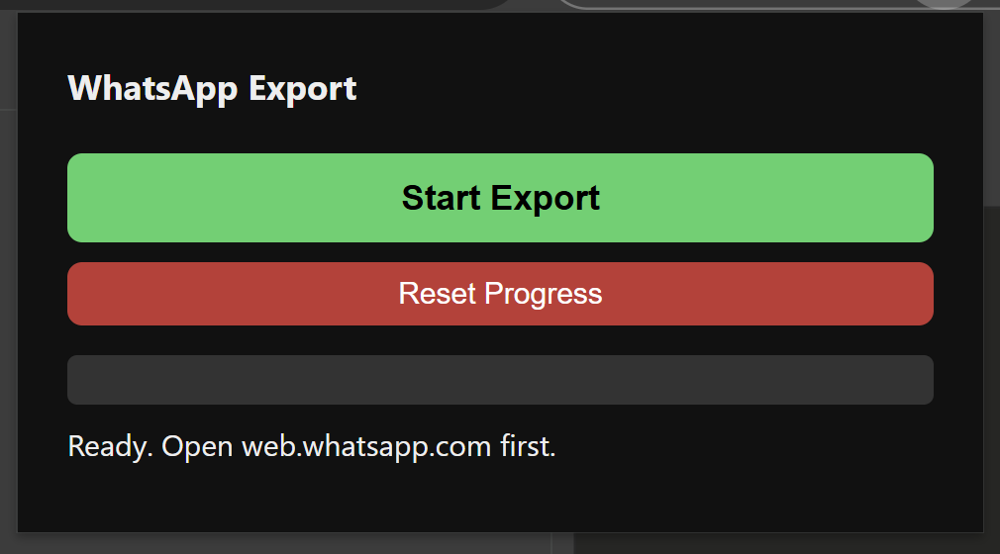

# WhatsApp Backup Chrome Extension


Export all your WhatsApp Web conversations to a single markdown file.



## What it does

- Scrapes every conversation from WhatsApp Web (sidebar + full message history)
- Exports to a `.md` file organized by contact with date headers
- Tracks progress so it can resume if interrupted
- Saves to disk periodically (every 10 chats) so you don't lose work
- Uses Chrome's debugger API for real mouse clicks (works with React/WhatsApp's event system)
- Media is noted as `[image]`, `[video]`, `[voice note]`, `[document]`, `[sticker]`

## Output format

```markdown
## Contact Name
*123 messages*
### 3/15/2026
`9:30 PM` **You**: Hello there
`9:31 PM` **Contact Name**: Hey!
`9:32 PM` **You**: [image] Check this out

---
```

## Installation

1. Clone this repo or download the files
2. Open `chrome://extensions` in Chrome
3. Enable **Developer mode** (toggle in the top right)
4. Click **Load unpacked** and select this folder

## Usage

1. Open [web.whatsapp.com](https://web.whatsapp.com) in Chrome and make sure your chats are loaded
2. Click the extension icon in the toolbar
3. Click **Start Export**
4. Chrome will show a blue "debugging" bar at the top. This is normal and expected.
5. Let it run. You can close the popup and reopen it to check progress.
6. The file `whatsapp-export.md` will be saved to your Downloads folder periodically and when complete.

## How it works

1. Scrolls through the sidebar to discover all conversations (handles WhatsApp's virtualized list)
2. For each conversation: clicks into it using CDP mouse events, scrolls to load full history, extracts all messages
3. Messages are parsed from WhatsApp's `data-pre-plain-text` attribute which contains `[TIME, DATE] SENDER:`
4. Message text comes from `[data-testid="selectable-text"]` elements
5. Progress is stored in `chrome.storage.local` so the export survives page reloads or browser restarts

## Resume after interruption

If the export stops for any reason, just click **Start Export** again. It will skip already-completed conversations and continue where it left off. Use **Reset Progress** to start fresh.

## Permissions

- `debugger`: Required for sending real mouse click events that WhatsApp's React app responds to
- `activeTab`: Access the WhatsApp Web tab
- `downloads`: Save the exported markdown file
- `storage`: Persist progress and logs between sessions

## Limitations

- Only works with WhatsApp Web (web.whatsapp.com)
- Requires Chrome (uses Chrome-specific extension APIs)
- The debugger info bar will be visible while the export runs
- Speed depends on how many messages each conversation has (scrolling to load history takes time)
- Group chat sender names may show as phone numbers if they aren't in your contacts

## License

GPL-3.0
